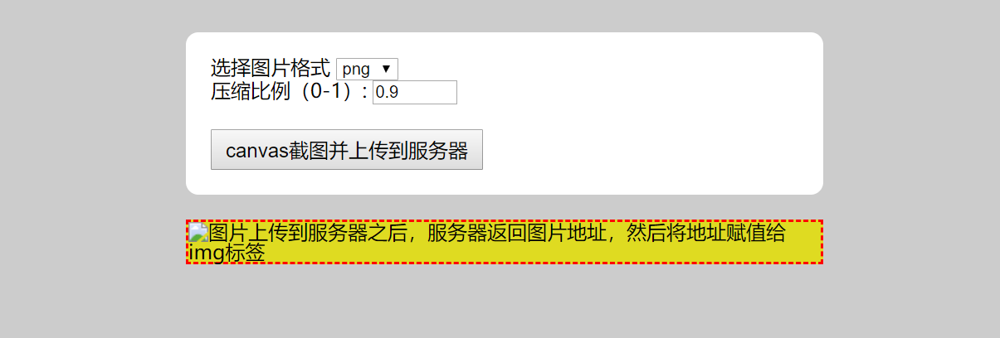
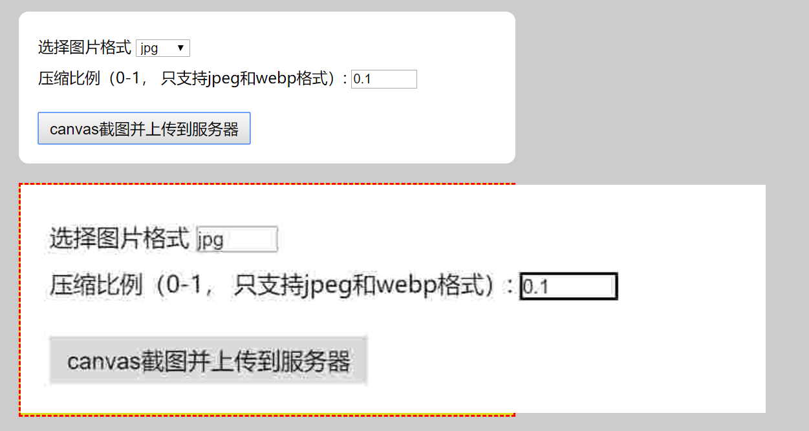

# canvas2nodejs
Use canvas to generate png, jpg and other format images, select the compression ratio, upload to nodejs and save to hard disk.

## run
```bash
cd canvas2nodejs
node app
```

## open broswer
1. open localhost:3000


2. click button, then you see the image from backend
