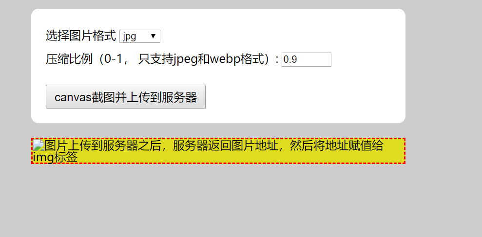
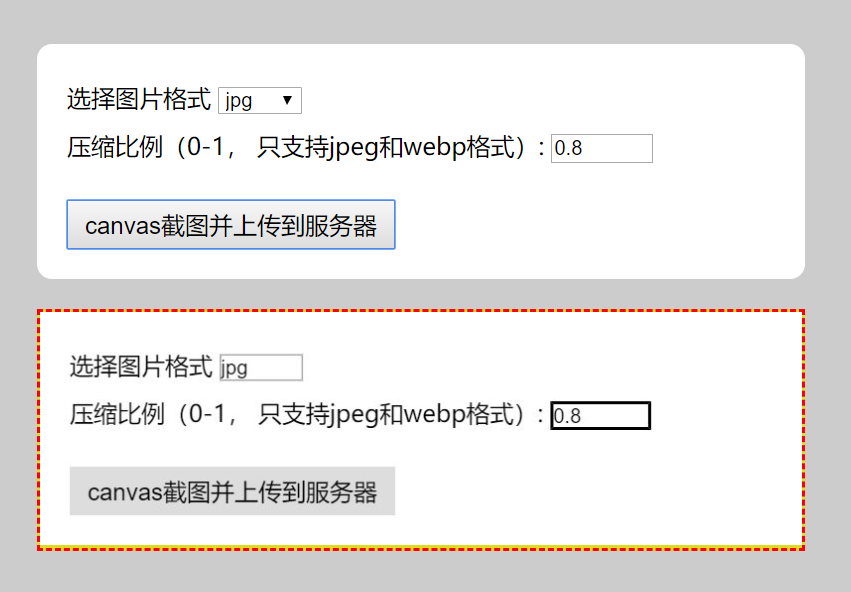

# html to image
Converting HTML to images using canvas
Converting HTML to images using canvas, select image type and compression ratio, upload to nodejs and save to hard disk.

## run
```bash
cd html2image
node app
```

## open broswer
1. open localhost:3000


2. click button, then you see the image from backend
